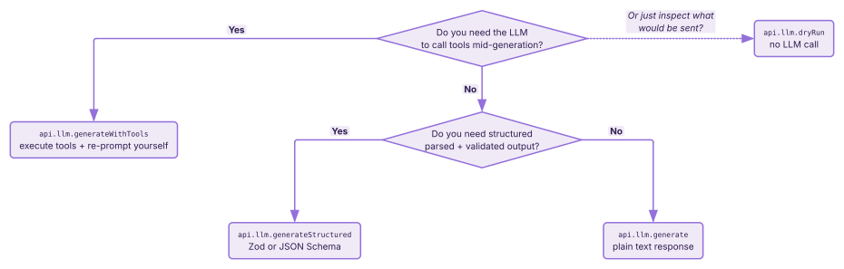

# Calling the LLM

`api.llm.*` gives a script four ways to interact with the LLM connection the user has configured: plain text generation, validated structured JSON, tool-using generation, and a dry-run that assembles the prompt without calling the model — plus a streaming variant of the plain-text path. All five surfaces require the `generation` permission (see [`concepts/permissions.md`](../concepts/permissions.md) for the broader gate).

The host wraps `spindle.generate.raw()`, so everything flows through the user's selected connection profile — your script doesn't see provider API keys, doesn't pick endpoints, and doesn't know whether the user is using OpenAI / Anthropic / a local model. It just sends messages and gets responses.

## Four primitives, one decision tree



Most non-trivial scripts use two or three of these together — a `dryRun` during dev to inspect the prompt, then `generateStructured` for analysis, plus `generateWithTools` when the script wants the LLM to drive a multi-step interaction.

## Quick start

Score a message on sentiment using a Zod-validated structured response:

```js
import { z } from 'zod';

const SentimentSchema = z.object({
  sentiment: z.enum(['positive', 'neutral', 'negative']),
  confidence: z.number().min(0).max(1),
  reason:     z.string(),
});

const result = await api.llm.generateStructured(
  [
    { role: 'system', content: 'You score messages on emotional sentiment.' },
    { role: 'user',   content: data.message.content },
  ],
  SentimentSchema,
  { connectionName: 'fast' },  // optional — see "Connection profiles" below
);

console.log(result.sentiment, result.confidence, result.reason);
// → 'positive', 0.87, 'Enthusiastic tone, exclamation marks.'
```

`result` is typed as the inferred Zod type. If the LLM returns malformed JSON or content that fails validation, the call throws synchronously — no retry, no silent fallback. See [Schema validation](#schema-validation--errors-not-retries) below.

## `generate(messages, options?)` — plain text

```ts
generate(messages: LLMMessage[], options?: LLMOptions): Promise<string>
```

The simplest call. Returns the raw text response as a string. Use when you just want the model to write prose — chat-style summaries, narrative inserts, casual responses.

```js
const reply = await api.llm.generate([
  { role: 'system', content: 'You are a helpful assistant.' },
  { role: 'user',   content: 'Summarise the last message in five words.' },
]);
```

### Message shape

```ts
interface LLMMessage {
  role: 'system' | 'user' | 'assistant';
  content: string | LlmMessagePart[];
  reasoning_content?: string;  // DeepSeek thinking-mode echo-back
}
```

`role` is one of three — not `'tool'` (tool calls and results are carried inside the `content` array as discriminated parts, see below).

`content` can be a plain string OR an array of multi-part parts:

```ts
type LlmMessagePart =
  | { type: 'text';        text: string }
  | { type: 'image';       data: string;        mime_type: string }
  | { type: 'audio';       data: string;        mime_type: string }
  | { type: 'tool_use';    id: string;          name: string;     input: Record<string, unknown> }
  | { type: 'tool_result'; tool_use_id: string; content: string;  is_error?: boolean };
```

Image and audio parts carry base64-encoded `data` + a MIME type — use these when you want the LLM to see attached images directly (vision-capable providers only).

```js
const text = await api.llm.generate([
  { role: 'user', content: [
    { type: 'text',  text: 'What is in this image?' },
    { type: 'image', data: base64bytes, mime_type: 'image/png' },
  ]},
]);
```

## `generateStream(messages, options?)` — streaming text

```ts
generateStream(messages: LLMMessage[], options?: LLMOptions): AsyncGenerator<StreamChunk, void, void>
```

Streaming variant of `generate`. Returns an async iterator that yields token-level chunks as they arrive from the provider, followed by exactly one terminal `'done'` chunk that carries the full aggregated text, the finish reason, and (when the provider reports them) `usage` token counts.

```js
let buffer = '';
for await (const chunk of api.llm.generateStream(messages)) {
  if (chunk.type === 'token')     buffer += chunk.token;
  else if (chunk.type === 'done') console.log('finished:', chunk.finish_reason);
}
```

### Chunk shape

```ts
type StreamChunk =
  | { type: 'token';     token: string }
  | { type: 'reasoning'; token: string }
  | {
      type:          'done';
      content:       string;       // full aggregated text
      reasoning?:    string;       // full aggregated chain-of-thought (when present)
      finish_reason: string;       // 'stop' | 'length' | 'tool_calls' | 'content_filter' | provider-specific
      tool_calls?:   ToolCall[];   // set when finish_reason === 'tool_calls'
      usage?:        { prompt_tokens: number; completion_tokens: number; total_tokens: number };
    };
```

Three variants, switch on `type`. `'token'` chunks are incremental visible-content deltas — concatenate them to get the streamed text. `'reasoning'` chunks are incremental chain-of-thought deltas from thinking-mode models (DeepSeek-thinking, Anthropic extended-thinking, …); providers without thinking mode skip these entirely. The terminal `'done'` chunk is emitted exactly once on successful completion.

Field naming is snake_case throughout, matching `LLMRawResult` and the upstream DTO. The `usage` field is **stream-only** — the non-stream `generate` / `generateStructured` / `generateWithTools` methods don't currently surface it.

### When to stream

Stream when:

- **Latency-to-first-token matters.** Showing partial output as it arrives feels far snappier than a 5-second wait for a complete response. Chat-style UIs, narrator boxes, anything user-visible benefits.
- **You want early-stop on partial output.** Inspecting `'token'` chunks as they arrive lets you abort the generation when the model produces something unwanted, instead of paying the full token cost.
- **You need `usage` counts.** Currently only `generateStream` surfaces token usage; non-stream calls don't.

Don't stream when:

- You're producing structured JSON. Use `generateStructured` — the engine validates against your schema and a partial JSON object isn't useful anyway.
- You need tool-calling. Use `generateWithTools` — `generateStream` doesn't currently support the tool-loop pattern.
- You don't surface output to the user incrementally. The extra plumbing (buffer, for-await, break-handling) earns nothing if you're going to await the whole result anyway. Use `generate`.

### Cancellation — two paths

Streams support two cancellation paths and they compose:

**Consumer break** — Breaking out of the `for await` loop calls `.return()` on the iterator, which propagates upstream and tears down the in-flight HTTP request. Useful for partial-output-informed abort:

```js
let buffer = '';
for await (const chunk of api.llm.generateStream(messages)) {
  if (chunk.type !== 'token') continue;
  buffer += chunk.token;

  // Bail as soon as the model produces something we won't ship
  if (/\b(banned-pattern|other-veto)\b/i.test(buffer)) break;
}
```

**External `AbortSignal`** — Pass `options.signal` to cancel from outside the loop. The next iterator pull rejects with an `AbortError`. Compose with `AbortSignal.timeout()` / `AbortSignal.any([...])` like the non-streaming methods:

```js
const ctrl = new AbortController();
setTimeout(() => ctrl.abort(), 5000);  // 5-second wall-clock cap

try {
  for await (const chunk of api.llm.generateStream(messages, { signal: ctrl.signal })) {
    if (chunk.type === 'token') process.stdout.write(chunk.token);
  }
} catch (err) {
  if (err.name === 'AbortError') console.log('cancelled');
  else throw err;
}
```

Either path correctly tears down the upstream connection — you won't keep paying tokens after the consumer stops listening. The worker host also auto-aborts in-flight streams on extension teardown, same as the non-streaming methods.

### Errors surface on first iteration

Permission denied, unknown provider, connection-not-found, and other validation failures don't throw at the call site — they surface on the first `await` against the iterator (typically the first iteration of `for await`). The async generator returned by `generateStream` is a thin handle; the underlying validation + connection-resolution + HTTP request all happen as the consumer starts pulling chunks. Wrap your loop in `try / catch` if you want to handle validation errors distinctly from in-stream errors.

```js
try {
  for await (const chunk of api.llm.generateStream(messages)) {
    /* … */
  }
} catch (err) {
  console.error('stream failed:', err.message);
  // PERMISSION_DENIED, unknown provider, connection not found,
  // upstream HTTP failure, AbortError — all land here.
}
```

## `generateStructured(messages, schema, options?)` — validated JSON

```ts
generateStructured<T>(
  messages: LLMMessage[],
  schema:   ZodLike<T> | Record<string, unknown>,
  options?: LLMOptions,
): Promise<T>
```

Use when the LLM's job is to produce structured data — scoring, extraction, classification, analysis — and you want the response parsed + validated before you touch it.

The `schema` argument accepts two shapes:

- **A Zod schema** (anything with a `.parse(unknown): T` method — the `ZodLike<T>` structural interface). The engine introspects it via Zod's `toJSONSchema()` and forwards both the schema (to constrain the model where the provider supports it — OpenAI structured output, Anthropic `output_config`, Google `responseMimeType`, etc.) AND uses the same Zod object to validate the response on the way back.

- **A plain JSON Schema object** (`Record<string, unknown>`). Skips the Zod validation pass but still forwards the schema to the provider's native structured-output mode. Use when you need a schema shape that Zod doesn't model cleanly, or when you want to skip the validation overhead.

### Schema validation — errors, not retries

When `generateStructured` returns content that doesn't parse as JSON or fails Zod validation, the call **throws synchronously**:

- **JSON parse failure** → `Error("api.llm.generateStructured: response was not valid JSON: <first 200 chars>")`
- **Zod validation failure** → `Error("api.llm.generateStructured: schema validation failed: <zod-error-message>")`

There is **no retry**. The engine doesn't loop, doesn't ask the model to fix its output, doesn't fall back to "try again with stricter instructions." If you want retry-on-validation-failure semantics, wrap the call yourself:

```js
async function generateStructuredWithRetry(messages, schema, opts, maxAttempts = 3) {
  for (let attempt = 1; attempt <= maxAttempts; attempt++) {
    try {
      return await api.llm.generateStructured(messages, schema, opts);
    } catch (err) {
      if (attempt === maxAttempts) throw err;
      console.warn(`Validation failed on attempt ${attempt}, retrying: ${err.message}`);
    }
  }
}
```

In practice, well-shaped schemas + a capable model + clear system-prompt directives produce valid output >95% of the time. Retries are a safety net, not a correctness mechanism.

## `generateWithTools(messages, tools, options?, schema?)` — tool-using generation

```ts
// 3-arg form
generateWithTools(messages, tools, options?): Promise<LLMRawResult>

// 4-arg form (with final-content schema)
generateWithTools<T>(messages, tools, options, schema): Promise<LLMRawResultStructured<T>>
```

This is the one most likely to surprise you, so it's worth stating up front:

> **`generateWithTools` does NOT run an internal agentic loop.** Each call is ONE round-trip. The method returns either `{ tool_calls: [...] }` (model wants to use tools) or `{ content: "..." }` (model produced a final answer). When you get tool_calls back, executing them + re-prompting with the results is *your* script's job.

This deliberately gives you control over the loop — you can short-circuit, parallelise tool execution, inject extra messages between rounds, abort on certain tool outputs, etc.

### Tool definitions

```ts
tools: Array<{
  name: string;
  description: string;
  parameters?: Record<string, unknown>;  // JSON Schema
}>
```

The `tools` array is a flat list (no provider-specific `{ type: 'function', function: {...} }` wrapper layer — the engine adds that for you).

```js
const tools = [
  {
    name: 'get_weather',
    description: 'Get current weather for a location.',
    parameters: {
      type: 'object',
      properties: {
        location: { type: 'string', description: 'City name' },
      },
      required: ['location'],
    },
  },
];
```

### The result shape

3-arg form returns `LLMRawResult`:

```ts
interface LLMRawResult {
  content: string;
  tool_calls?: ToolCall[];
  reasoning_content?: string;  // DeepSeek thinking-mode
}

interface ToolCall {
  name:    string;
  args:    Record<string, unknown>;
  call_id: string;  // Provider call id, or synthetic UUID
}
```

4-arg form returns `LLMRawResultStructured<T>`:

```ts
interface LLMRawResultStructured<T> {
  content?:           T;             // Validated against `schema` — ONLY on the final step
  tool_calls?:        ToolCall[];    // Mutually exclusive with content
  reasoning_content?: string;
}
```

**Key semantics for the 4-arg form**: the `schema` only validates the *final* `content` — the step where the model produced an answer instead of more tool calls. Intermediate steps that come back with `tool_calls` populated do *not* validate against the schema (and `content` will be undefined / a brief acknowledgement string at most). Don't try to use `schema` to validate tool-call args; that's not what the parameter is for. Tool args validation is the model's responsibility, gated by the per-tool `parameters` JSON Schema.

**Validation-failure behavior differs from `generateStructured`.** When `generateStructured` gets a final content that fails Zod validation, it **throws** with `api.llm.generateStructured: schema validation failed: <zod-error-message>`. The 4-arg `generateWithTools` **silently falls back** to returning the raw (parsed-but-unvalidated) JSON content in `result.content` — no throw, no warning (`llm.ts:412`). If you need strict validation in the tools-loop path, wrap the result in your own Zod parse after the call returns and handle the throw manually. Practical implication: when the model occasionally produces a structurally-different final answer than your schema expects, `generateStructured` is loud about it, `generateWithTools+schema` is silent.

### The loop you write

```js
const messages = [
  { role: 'system', content: 'You can call get_weather to look up weather.' },
  { role: 'user',   content: 'What is the weather in Tokyo and Paris?' },
];

const tools = [{ name: 'get_weather', description: '...', parameters: { /* ... */ } }];

for (let step = 0; step < 10; step++) {  // hard cap as a runaway-protection
  const result = await api.llm.generateWithTools(messages, tools);

  if (!result.tool_calls || result.tool_calls.length === 0) {
    // Final answer.
    console.log(result.content);
    break;
  }

  // Append the model's tool-use message AND the tool results to messages.
  messages.push({
    role: 'assistant',
    content: result.tool_calls.map(tc => ({
      type:  'tool_use',
      id:    tc.call_id,
      name:  tc.name,
      input: tc.args,
    })),
  });

  for (const tc of result.tool_calls) {
    const toolResult = await executeMyTool(tc.name, tc.args);
    messages.push({
      role: 'user',
      content: [{
        type:        'tool_result',
        tool_use_id: tc.call_id,
        content:     JSON.stringify(toolResult),
      }],
    });
  }
}
```

The `step` cap is yours to choose — there's no host-side runaway guard on this loop because the host doesn't know it's a loop. A typical task converges in 1-3 LLM rounds.

### Mistral compatibility

Mistral's API explicitly rejects requests that combine `response_format` (structured output) with `tools`. The engine detects this at the request boundary and silently drops the conflicting field. If you're targeting Mistral specifically, set `options.parallelToolCalls: false` to force serialised tool-call rounds, which the model handles more reliably:

```js
await api.llm.generateWithTools(messages, tools, {
  parallelToolCalls: false,
});
```

Non-Mistral providers ignore the flag if they don't honor it.

## `dryRun(options?)` — assemble without calling

```ts
dryRun(options?: DryRunOptions): Promise<DryRunResult>
```

Useful during dev when you want to see what the host actually assembles + sends to the LLM — message array, parameter overrides, per-block token counts, world-info activation stats, long-term memory retrieval stats — without paying for a call.

```js
const dry = await api.llm.dryRun({ chatId: data.chatId });
console.log(`Total messages: ${dry.messages.length}`);
console.log(`Total tokens:   ${dry.tokenCount?.totalTokens}`);
console.log(`Model:          ${dry.provider}/${dry.model}`);
console.log(`Breakdown:`);
for (const block of dry.breakdown) {
  console.log(`  ${block.name} (${block.type}): ${block.tokens} tokens`);
}
```

`DryRunResult` includes:

| Field | Type | Notes |
|---|---|---|
| `messages` | `LLMMessage[]` | The fully assembled message array. |
| `breakdown` | `DryRunBlock[]` | Ordered prompt-composition blocks (system / character card / world info / chat history / etc.) with per-block token counts. |
| `parameters` | `Record<string, unknown>` | Final merged sampler parameters. |
| `model` / `provider` | `string` | Resolved connection. |
| `tokenCount?` | `DryRunTokenCount` | Per-block + total token counts (omitted when no tokenizer is configured). |
| `worldInfoStats?` | `WorldInfoActivationStats` | Which world-info entries activated + budget usage. |
| `memoryStats?` | `DryRunMemoryStats` | Long-term-memory chunk retrieval stats. |

`dryRun` also requires the `generation` permission — it's a "preview the generation pipeline" surface, not a "free intro" surface.

## `LLMOptions` reference

```ts
interface LLMOptions {
  connectionId?:      string;
  connectionName?:    string;
  provider?:          LLMProvider;
  model?:             string;
  temperature?:       number;
  maxTokens?:         number;
  parallelToolCalls?: boolean;
  signal?:            AbortSignal;
}
```

### Connection resolution — strict precedence

The connection that actually serves the request is resolved by short-circuiting in this order:

1. **`connectionId`** wins outright — the saved profile with this exact ID is used. Other fields are still honored as overrides at call time (see below).
2. **`connectionName`** is consulted if `connectionId` is unset — resolved case-insensitively against the user's saved profile names. Throws if no match.
3. **Default profile** — the connection marked `is_default: true`, or the first available if none is default.

`provider` and `model` are **overrides applied on top** of whatever the resolved profile says. So `{ connectionId: 'X', model: 'gpt-4o' }` uses connection X's provider + API key but forces the model to `gpt-4o` for this call. Use this when you want a connection's auth setup but a different model than the profile defaults to.

### Sampler overrides

`temperature` and `maxTokens` override the connection profile's defaults for this call only. Omitting them lets the profile decide.

### Connection profiles — pick fast for sub-agent work

The connection setup typically has at least two profiles: the user's flagship (the model they pay attention to in chat) and a fast one (cheap + low-latency, used for auxiliary script-driven analysis). If your script is doing background work — sentiment scoring, content extraction, structured analysis — point it at the fast profile rather than burning the flagship's tokens:

```js
await api.llm.generateStructured(messages, schema, { connectionName: 'fast' });
```

The exact profile names depend on the user's setup; convention is `fast` for the auxiliary tier, but read whatever the user has configured. Falling back to the default profile when a specific name isn't there is reasonable polite behavior — wrap the call in a try/catch on the `connectionName not found` throw and re-attempt without `connectionName`.

## Cancellation via `AbortSignal`

Pass `options.signal` to make a generation cancellable. When the signal aborts, the upstream LLM request is torn down at the fetch level and the returned promise rejects with an `AbortError`:

```js
const ctrl = new AbortController();
setTimeout(() => ctrl.abort(), 10_000);  // 10s timeout

try {
  const text = await api.llm.generate(messages, { signal: ctrl.signal });
  // ... use text
} catch (err) {
  if (err instanceof Error && err.name === 'AbortError') {
    console.log('Generation cancelled — not an error.');
    return;
  }
  throw err;  // anything else is a real error
}
```

Compose with the standard cancellation primitives:

```js
// 10-second timeout
{ signal: AbortSignal.timeout(10_000) }

// First of two: user explicitly cancels OR timeout fires
{ signal: AbortSignal.any([userCancelCtrl.signal, AbortSignal.timeout(10_000)]) }
```

**The worker host auto-aborts in-flight generations on extension teardown.** You don't have to thread a signal just to avoid leaking a request when the user disables your script — that's handled. Thread a signal when *the script* needs to cancel for its own reasons (user pressed a cancel button, racing multiple model calls, per-request timeout).

## Common patterns

### Schema-driven content analysis

```js
const Score = z.object({
  helpfulness: z.number().min(0).max(10),
  accuracy:    z.number().min(0).max(10),
  notes:       z.string(),
});

const score = await api.llm.generateStructured(
  [
    { role: 'system', content: 'You evaluate assistant responses on helpfulness and accuracy.' },
    { role: 'user',   content: `Response to evaluate:\n\n${data.message.content}` },
  ],
  Score,
  { connectionName: 'fast' },
);

await api.events.track('response_score', { messageId: data.message.id, ...score });
```

### Cancellable user-action with a UI affordance

```js
const ctrl = new AbortController();

const modal = api.ui.dom.inject('body', `
  <div class="ls-thinking">
    Thinking…
    <button data-action="cancel">Cancel</button>
  </div>
`);

modal.on('click', (ev) => {
  if (ev.dataset?.action === 'cancel') ctrl.abort();
});

try {
  const reply = await api.llm.generate(messages, { signal: ctrl.signal });
  modal.update(`<div class="ls-reply">${reply}</div>`);
} catch (err) {
  if (err.name === 'AbortError') {
    modal.remove();
    return;
  }
  modal.update(`<div class="ls-error">${String(err.message)}</div>`);
}
```

### Tool-using research agent

```js
const tools = [
  { name: 'search_databank',  description: '...', parameters: { /* ... */ } },
  { name: 'fetch_world_info', description: '...', parameters: { /* ... */ } },
];

const messages = [
  { role: 'system', content: 'You research questions using the available tools.' },
  { role: 'user',   content: data.message.content },
];

for (let step = 0; step < 5; step++) {
  const result = await api.llm.generateWithTools(messages, tools, { connectionName: 'fast' });
  if (!result.tool_calls?.length) {
    await api.chat.sendMessage(result.content, { role: 'assistant' });
    break;
  }
  // ... execute tools, append results, continue
}
```

## Common pitfalls

- **`generateWithTools` is not a loop.** One LLM round-trip per call; *your* loop drives multi-step interactions. Tools that span multiple model rounds need the explicit re-prompt pattern above.

- **Schema in the 4-arg form validates final content only.** When `tool_calls` come back, the schema isn't enforced on tool args (that's the tool's `parameters` JSON Schema). When the final answer arrives without tool_calls, then it validates.

- **No streaming surface yet.** If you reach for `stream` / `quietStream` / `rawStream` / `AsyncIterable` return types — they don't exist. Track B (LLM streaming) is deferred past v1.0. Full responses only for now.

- **Schema-validation behavior differs between `generateStructured` and `generateWithTools+schema`.** `generateStructured` throws synchronously on validation failure (no retry). The 4-arg `generateWithTools` silently falls back to the raw parsed value on validation failure — covered in [generateWithTools — Key semantics for the 4-arg form](#generatewithtools--key-semantics-for-the-4-arg-form). Wrap with retry logic where you need it; don't assume the throw will happen in the tools-loop path.

- **`role: 'tool'` doesn't exist on `LLMMessage`.** Tool requests + results live inside `content` as `tool_use` / `tool_result` parts (see the LlmMessagePart shape). Don't try to push `{ role: 'tool', content: '...' }` — it'll be rejected.

- **Mistral + structured-output + tools combo is provider-rejected.** The engine detects the Mistral case and silently drops `response_format` to keep tool-calling working. If you want strict structured output AND tools on Mistral, you need to make two separate calls.

- **Watch token budgets.** Big system prompts + long history + JSON-Schema-driven structured output is easy to inflate past the model's context. Use `dryRun()` during dev to see the actual assembled-token total before running into a context-overflow error mid-conversation.

- **Don't burn the flagship on auxiliary work.** Point sub-agent / analyst calls at `connectionName: 'fast'`. The user's premium model is for the chat they're paying attention to, not for your script's background sentiment scoring.

## See also

- **In-app Reference, "API Functions → api.llm" section** — auto-generated method list with full signatures, permission tags, and per-method notes.
- **[`concepts/permissions.md`](../concepts/permissions.md)** — `generation` permission, graceful denial handling.
- **[`concepts/trigger-model.md`](../concepts/trigger-model.md)** — the `data` global your scripts react to + the sandbox boundary.
- **Macros guide** *(coming next)* — `api.macros.*` for injecting computed content into the prompt assembly pipeline. Pairs naturally with `dryRun()` for inspecting what your macros end up contributing.
- **Tools guide** *(coming)* — `api.tools.*` for registering tools that the Council / inline function-calling can invoke. Inversion of `generateWithTools`: you're the tool author, not the tool consumer.
- **The `ls:council-prompt` built-in library** — pure helpers for replicating Lumiverse's Council-sidecar prompt shape inside extension-authored tools. See the Reference's "Built-in Libraries" section.
